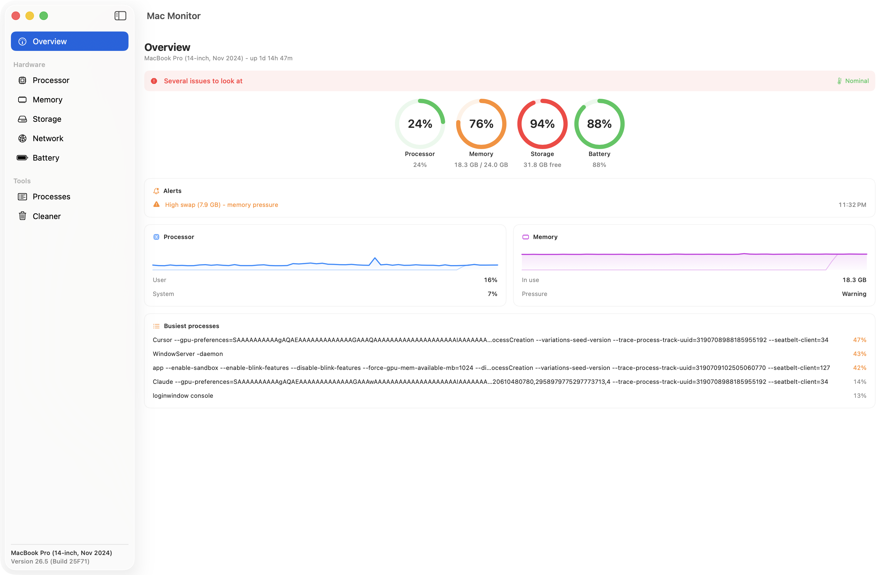
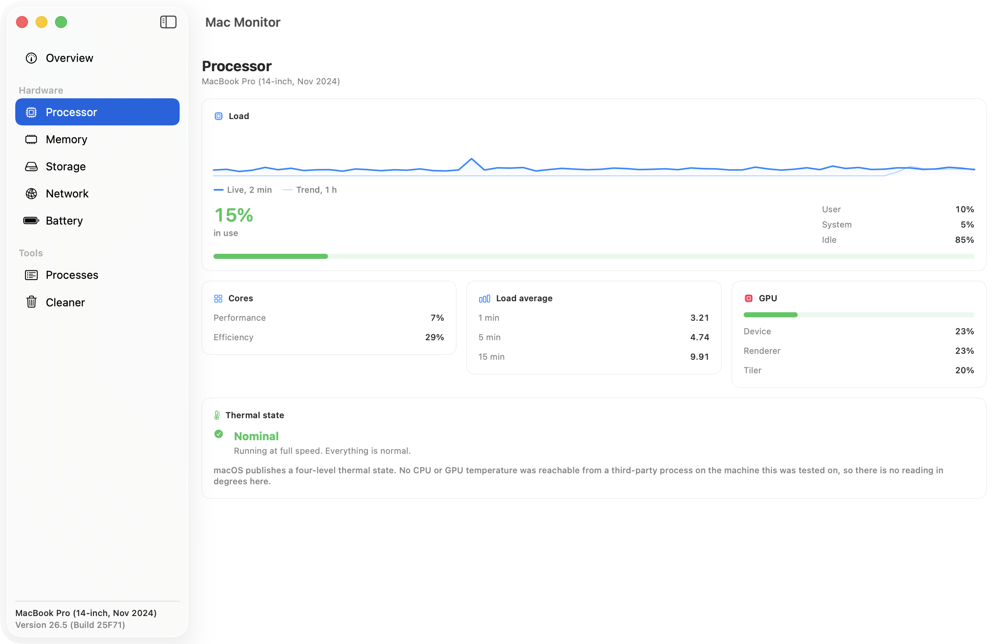
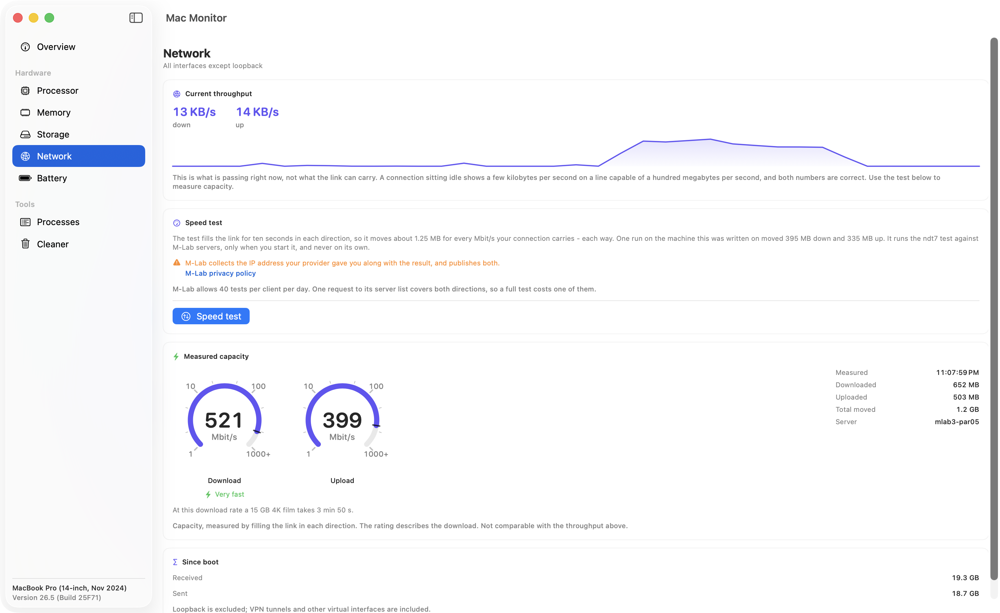
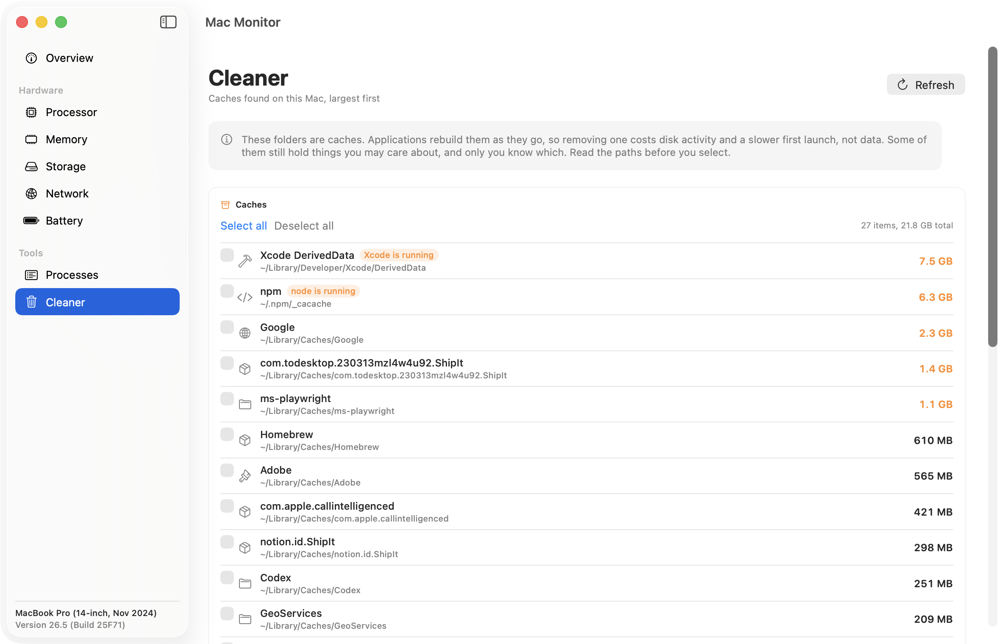

# MacMonitor

A macOS system monitor, written to find out what was actually wrong with my own Mac
and then finished properly.

It is a window with a sidebar, not a menu bar app, and it tries to be right rather
than complete. Where a value could not be measured honestly, it is not shown.



<details>
<summary>The other screens, and all four in dark</summary>





Dark: [Overview](docs/images/overview-dark.png) ·
[Processor](docs/images/processor-dark.png) ·
[Network](docs/images/network-dark.png) ·
[Cleaner](docs/images/cleaner-dark.png)

</details>

Every reading in those is live, from this machine, at the moment of the capture. The
Network screen shows a real ndt7 run against `mlab2-par05` — 680 Mbit/s down and 307
up, 1.2 GB moved — beside a current throughput of 3 kB/s, which is the pair of numbers
this README spends a section on.

## What it measures

Eight screens: Overview, then Processor, Memory, Storage, Network and Battery, then
Processes and Cleaner. Every figure comes from the API named beside it.

| Screen | Figure | Source |
|---|---|---|
| Processor | user / system / idle | `host_statistics` with `HOST_CPU_LOAD_INFO`, as a delta between samples |
| Processor | performance and efficiency cluster load | `host_processor_info`, split by `cluster-type` read from the `IODeviceTree` plane |
| Processor | load averages | `getloadavg(3)` |
| Processor | GPU device / renderer / tiler | `IOAccelerator` → `PerformanceStatistics` |
| Processor | thermal state | `ProcessInfo.processInfo.thermalState` |
| Memory | active, wired, compressed, inactive | `host_statistics64` with `HOST_VM_INFO64`, scaled by `vm_page_size` |
| Memory | installed | `sysctlbyname("hw.memsize")` |
| Memory | pressure | `sysctlbyname("kern.memorystatus_vm_pressure_level")` |
| Memory | swap used and total | `sysctlbyname("vm.swapusage")` into `xsw_usage` |
| Storage | used / free / total | `FileManager.attributesOfFileSystem` |
| Storage | read and write activity | `IOBlockStorageDriver` → `Statistics`, as a delta |
| Network | current throughput, totals since boot | `net.link.generic.ifdata.<index>.general`, all interfaces except loopback |
| Network | measured capacity, both directions | ndt7 against M-Lab, on demand only |
| Battery | charge, time remaining | `IOPSCopyPowerSourcesList` |
| Battery | cycles, temperature, power, full-charge capacity | `AppleSmartBattery` in the IORegistry |
| Overview | machine name | `product-name` from `IODeviceTree:/product` |
| Overview | uptime | `sysctl` `kern.boottime` |
| Processes | name, CPU, memory | `ps aux` — the one shell command left, see below |
| Cleaner | cache sizes | directory enumeration; removal goes through `FileManager.trashItem` |

The Memory screen also carries a card comparing its own arithmetic against Activity
Monitor's, because the two do not use the same formula and the difference is worth
seeing rather than hiding.

## What it cannot measure

No CPU or GPU temperature, and no fan speed. That is not a limitation of this app: the
`powermetrics --samplers smc` route those articles all recommend no longer exists, and
the sampler name is rejected *before* the privilege check, so you can confirm it on
your own machine without granting anything:

```
$ powermetrics --samplers smc -n 1
powermetrics: unrecognized sampler: smc
```

The full account, with the ten samplers that do exist, is in
[docs/apple-silicon-sensors.md](docs/apple-silicon-sensors.md). The battery
temperature *is* readable, and it is shown.

## What was deliberately left out

- **IOReport**, which would give real CPU and GPU frequency residency. It is a private
  framework.
- **Per-process network throughput.** `nettop` needs no privileges and reports
  correctly, but it rests on the private `NetworkStatistics.framework`, and its
  per-process totals do not reconcile with the interface counters. That part is
  inherent, not a bug to fix: `nettop` reports a cumulative total per *live* process,
  so a process that exits takes its entire history out of the sum. Three runs, each
  downloading 40 MB over eight seconds:

  | | interface counters | sum over processes |
  |---|---:|---:|
  | run 1 | +45,139,102 | +2,052,831 |
  | run 2 | +42,679,257 | +4,896 |
  | run 3 | +42,705,386 | −1,532,642 |

  The left column is stable and the right column is not even reliably positive.
  Sampling it every cycle would also put a subprocess back on a hot path that had just
  been cleared of them.
- **CoreWLAN** for Wi-Fi detail. Reading the SSID requires Location authorisation,
  which is a lot for a monitor to ask.
- **S.M.A.R.T. status.** The app used to print a hardcoded `"Verified"` as though it
  had been measured. That was deleted rather than kept; reading it properly is separate
  work.
- **Bluetooth device battery levels.** Not started.

## What the app costs to run

A system monitor should not be the thing loading the machine. Measured on an Apple M4
Pro over 90-second windows, counting the CPU time of the app process itself:

| | |
|---|---:|
| Before the collection was narrowed | 15.65 % of a core |
| Overview in the foreground | 3.74 % of a core |
| Window in the background | 0.00 % |
| Brought back to the foreground | 2.80 % |

The background figure is a real zero, not a rounding: the timers are torn down rather
than left firing into a no-op. In the foreground, a permanent set covers what Overview
and the alerts need, and the extra detail — GPU, the cluster split, disk and network
throughput, battery sensors — is collected only while the screen showing it is
selected. Switching away clears the previous screen's readings rather than leaving a
stale number on display as though it were live.

## Throughput is not capacity

The Network screen shows two numbers that can differ by four orders of magnitude and
both be correct.

**Throughput** is what is passing right now; an idle connection reads a few kilobytes
per second. **Capacity** is what the link carries when something deliberately fills
it, which is what a speed test measures. They live in separate cards, and the app
never computes one from the other.

The capacity test runs ndt7 against M-Lab servers, in both directions, only when you
press the button. On the M-Lab discussion list: *"Both speed.measurementlab.net and
Google's Internet Speed Test integrate NDT."*
([source](https://groups.google.com/a/measurementlab.net/g/discuss/c/iR4zO_rT4KE))

### What it costs, and why the app will not name one number

The test fills the link for ten seconds in each direction. That means what it moves is
not a property of the test at all — it is whatever your connection can carry. Ten
seconds at 1 Mbit/s is 1.25 MB, and it scales from there.

So the screen does not name a figure of its own. Before the first run it states the
rule; after one, it states what **your** last test moved, because by then the app has
measured your connection and has no need to guess at it. The old text said "about
885 MB", which was measured, honest, and a property of one machine on one evening — on
a 10 Mbit/s line the same test costs 12.5 MB, and the warning would have frightened off
the one reader it existed to protect.

Every complete run measured while building this:

| rate | moved | rule predicts |
|---:|---:|---:|
| 226 Mbit/s up | 285 MB | 283 MB |
| 254 Mbit/s up | 318 MB | 318 MB |
| 263 Mbit/s up | 335 MB | 329 MB |
| 312 Mbit/s down | 390 MB | 390 MB |
| 316 Mbit/s down | 395 MB | 395 MB |
| 350 Mbit/s down | 437 MB | 438 MB |
| 399 Mbit/s up | 503 MB | 499 MB |
| 521 Mbit/s down | 652 MB | 652 MB |
| 674 Mbit/s down | 885 MB | 843 MB |
| 688 Mbit/s down | 860 MB | 860 MB |

Every row lands within two per cent except the 674 Mbit/s one, which ran for ten and a
half seconds rather than ten and moved five per cent more for it.

The interface counters were read either side of one of those runs as an independent
reference: they saw 708 MB in and 529 MB out where the app counted 652 and 503, which
is 8.7 % and 5.2 % more. That is packet headers and the acknowledgements each direction
sends back — and it is also the check that the upload payloads are not being compressed
away, which is why they are random rather than zeroed.

### One test or two, against M-Lab's forty a day

M-Lab documents "a rate limit of 40 tests per client per day" and says a client that
hits it is answered with an HTTP 204 No Content. A 204 is an HTTP status, and the only
HTTP request in the whole flow is the one for the server list. That request returns
`wss://` URLs for both directions carrying the same access token — compared character
by character, identical — and that one token was observed opening a download connection
followed by four separate upload connections, all accepted.

So a complete test in both directions costs one of the forty. What is *not* established:
M-Lab nowhere writes the sentence "a bidirectional test counts as one". The conclusion
above is drawn from where the refusal is returned and from the token being reusable.

### The dial

The capacity reading sits on a logarithmic dial, base ten, three decades, 1 Mbit/s to
1000. Linear would be unreadable: over the same 270 degrees of travel, 5 Mbit/s would
sit 1.4 degrees from the stop and 20 Mbit/s 5.4 degrees, so every connection from
unusable to decent would occupy the first tenth of the dial while the top half waited
for speeds most people do not have. Logarithmically those two are 63 and 117 degrees,
which is the difference between reading a dial and squinting at it.

A link outside the scale pins the needle rather than running off the dial, and the exact
figure is printed in the middle either way. The top tick is labelled `1000+` for that
reason. The five-level rating underneath describes the **download**: its boundaries were
chosen for one, and calling an ordinary 25 Mbit/s upstream "slow" is a judgement nothing
here has earned.

## The page size trap

`vm_stat` reports page counts, not bytes. Multiplying them by 4096 is right on Intel
and wrong on every Apple Silicon Mac, where a page is 16384 bytes — so every memory
figure comes out at a quarter of the truth. This app did exactly that. It showed
4.24 GB used at the same instant `top` reported 23G, and coloured the gauge green.

Nothing failed. No exception, no `nil`, no warning; just a plausible number of
gigabytes that fitted comfortably inside the machine. The page size is now read at
runtime and the conversion is covered by tests.

Eight other defects of the same shape, each with the command that caught it, are in
[docs/plausible-and-wrong.md](docs/plausible-and-wrong.md). The last of them was found
after that document was finished and this README was committed, by looking at a
screenshot: the *Since boot* network total read 3.4 GB where `netstat -ib` read 12.0 GB,
because the routing table hands back `ifi_ibytes` truncated to 32 bits even though the
field is declared 64-bit.

## Architecture

Three layers, 4,297 lines of Swift across 19 files, plus 4 test files.

**Collection** reads the kernel and the IORegistry. One shell command remains, `ps`,
because a non-privileged process cannot read another user's CPU time:
`proc_pid_rusage` returns -1 for processes it does not own, and
`kinfo_proc.kp_proc.p_pctcpu` was populated for none of the 609 processes running when
it was tested. `/bin/ps` manages it by being setuid root (`-rwsr-xr-x 1 root wheel`).
The reasoning sits next to the call.

**Calculation** is pure functions over plain values — page conversion, tick deltas,
uptime formatting, health thresholds, speed tiers, the logarithmic dial scale, transfer
estimates. No I/O, no shared state. This is where the measurement bugs lived, and it is what the tests
cover.

**Views** are SwiftUI, one file per screen, over a shared design system that holds
every threshold, colour and number format in one place. Those had drifted: in the
first commit, "the disk is filling up" meant 60 %, 80 %, 85 %, 90 %, "under 20 GB" or
"under 10 GB" depending on which file you were reading.

## Tests

67 tests, on the calculation layer and the remaining parsers.

Each one is derived from the observed defect and the expected behaviour rather than
from reading the fix — a test written by reading the implementation mostly proves the
implementation agrees with itself. To check they actually bite, the original bugs were
reintroduced in a throwaway copy. At that point the suite was 32 tests:

| Bug put back | Tests that failed |
|---|---:|
| Page size hardcoded to 4096 | 2 |
| `dropFirst()` on `ps` output | 4 |
| Substring match on the `vm_stat` "compressor" lines, last one wins | 1 |

That last row is the interesting one. Two tests cover that bug and only one catches
it: the one whose fixture has the lines in the reverse order. On real `vm_stat` output
the buggy match lands on the right line by accident, so the obvious test passes either
way and proves nothing.

The first attempt at that mutation proved nothing either — it modelled the bug with a
`Dictionary`, whose order is undefined, where the original was an ordered loop in which
the last match wins. It had to be replayed faithfully before it detected anything.

## Building

Built with Xcode 26.6. Deployment target macOS 13. Clone and build; there is nothing to
configure.

Signing is ad-hoc (`CODE_SIGN_IDENTITY = "-"`, no development team), so it builds
without an Apple Developer account, and the result is not notarised.

The application icon is generated by `Tools/GenerateAppIcon.swift`, which is committed
alongside its output. Run `swift Tools/GenerateAppIcon.swift` to re-render it.

## Known gaps

- Everything here was measured on one machine: a `Mac16,8` running macOS 26.5
  (build 25F71). One data point, not a survey of the platform.
- Runtime behaviour on macOS 13 and 14 has never been tested. What *is* enforced is
  compile-time: Swift treats an API newer than the deployment target as an error, not a
  warning, so if this builds, nothing newer than macOS 13 is called without a guard.
- Intel Macs are untested. The page size handling is architecture-independent by
  construction, but nothing has been run there.
- Process memory is RSS, not the phys_footprint figure Activity Monitor shows, and the
  CPU percentage comes from `ps`, which reports a decaying average rather than an
  instantaneous reading.
- English only. There is no localisation.
- No UI tests. The interface is checked by hand.

## Licence

MIT. See [LICENSE](LICENSE).
